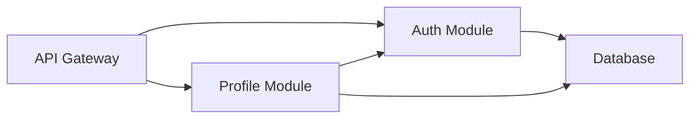

<style>
  /* Document Styling */
  body {
    font-family: -apple-system, BlinkMacSystemFont, 'Segoe UI', Roboto, 'Helvetica Neue', Arial, sans-serif;
    line-height: 1.6;
    color: #333;
    max-width: 1200px;
    margin: 0 auto;
    padding: 20px;
    background: linear-gradient(135deg, #f5f7fa 0%, #c3cfe2 100%);
  }

  /* Headers */
  h1 {
    color: #1a73e8;
    border-bottom: 4px solid #1a73e8;
    padding-bottom: 10px;
    margin-top: 30px;
    font-size: 2.5em;
    text-shadow: 2px 2px 4px rgba(0,0,0,0.1);
  }

  h2 {
    color: #1967d2;
    border-left: 5px solid #1967d2;
    padding-left: 15px;
    margin-top: 40px;
    font-size: 1.8em;
    background: linear-gradient(90deg, rgba(25,103,210,0.1) 0%, transparent 100%);
    padding: 10px 15px;
    border-radius: 0 8px 8px 0;
  }

  h3 {
    color: #185abc;
    margin-top: 25px;
    font-size: 1.4em;
    border-bottom: 2px solid #e8eaed;
    padding-bottom: 8px;
  }

  h4 {
    color: #1967d2;
    margin-top: 20px;
    font-size: 1.2em;
  }

  /* Code Blocks */
  pre {
    background: #282c34;
    color: #abb2bf;
    padding: 20px;
    border-radius: 8px;
    overflow-x: auto;
    border-left: 4px solid #61afef;
    box-shadow: 0 4px 6px rgba(0,0,0,0.1);
    margin: 15px 0;
  }

  code {
    background: #f1f3f4;
    padding: 2px 6px;
    border-radius: 4px;
    font-family: 'Courier New', Courier, monospace;
    color: #d73a49;
    font-size: 0.9em;
  }

  pre code {
    background: transparent;
    padding: 0;
    color: #abb2bf;
  }

  /* Tables */
  table {
    width: 100%;
    border-collapse: collapse;
    margin: 20px 0;
    background: white;
    box-shadow: 0 2px 8px rgba(0,0,0,0.1);
    border-radius: 8px;
    overflow: hidden;
  }

  thead {
    background: linear-gradient(135deg, #667eea 0%, #764ba2 100%);
    color: white;
  }

  th {
    padding: 15px;
    text-align: left;
    font-weight: 600;
    text-transform: uppercase;
    font-size: 0.85em;
    letter-spacing: 0.5px;
  }

  td {
    padding: 12px 15px;
    border-bottom: 1px solid #e8eaed;
  }

  tr:hover {
    background: #f8f9fa;
  }

  tr:last-child td {
    border-bottom: none;
  }

  /* Lists */
  ul, ol {
    margin: 15px 0;
    padding-left: 30px;
  }

  li {
    margin: 8px 0;
    line-height: 1.6;
  }

  /* Blockquotes */
  blockquote {
    border-left: 4px solid #ffa500;
    padding: 15px 20px;
    margin: 20px 0;
    background: #fff9e6;
    border-radius: 0 8px 8px 0;
    font-style: italic;
    color: #666;
  }

  /* Badges and Status Indicators */
  .status-done::before { content: "✅ "; }
  .status-progress::before { content: "🟡 "; }
  .status-pending::before { content: "⏭️ "; }
  .status-blocked::before { content: "🔴 "; }
  .status-healthy::before { content: "🟢 "; }
  .status-warning::before { content: "🟡 "; }
  .status-critical::before { content: "🔴 "; }

  /* Info Boxes */
  .info-box {
    background: #e8f4fd;
    border-left: 4px solid #1a73e8;
    padding: 15px 20px;
    margin: 20px 0;
    border-radius: 0 8px 8px 0;
  }

  .warning-box {
    background: #fff4e5;
    border-left: 4px solid #ff9800;
    padding: 15px 20px;
    margin: 20px 0;
    border-radius: 0 8px 8px 0;
  }

  .success-box {
    background: #e8f5e9;
    border-left: 4px solid #4caf50;
    padding: 15px 20px;
    margin: 20px 0;
    border-radius: 0 8px 8px 0;
  }

  .error-box {
    background: #ffebee;
    border-left: 4px solid #f44336;
    padding: 15px 20px;
    margin: 20px 0;
    border-radius: 0 8px 8px 0;
  }

  /* Horizontal Rules */
  hr {
    border: none;
    height: 2px;
    background: linear-gradient(90deg, transparent, #1a73e8, transparent);
    margin: 40px 0;
  }

  /* Links */
  a {
    color: #1a73e8;
    text-decoration: none;
    border-bottom: 1px solid transparent;
    transition: border-bottom 0.3s;
  }

  a:hover {
    border-bottom: 1px solid #1a73e8;
  }

  /* Checkboxes */
  input[type="checkbox"] {
    margin-right: 8px;
    transform: scale(1.2);
  }

  /* File Tree Styling */
  .file-tree {
    background: #1e1e1e;
    color: #d4d4d4;
    padding: 20px;
    border-radius: 8px;
    font-family: 'Courier New', Courier, monospace;
    line-height: 1.8;
  }

  /* Mermaid Diagrams */
  .mermaid {
    background: white;
    padding: 20px;
    border-radius: 8px;
    box-shadow: 0 2px 8px rgba(0,0,0,0.1);
    margin: 20px 0;
  }

  /* Section Cards */
  .section-card {
    background: white;
    padding: 25px;
    border-radius: 12px;
    box-shadow: 0 4px 12px rgba(0,0,0,0.1);
    margin: 20px 0;
    border-top: 4px solid #1a73e8;
  }

  /* Best Practices Styling */
  .do-item::before {
    content: "✅ DO: ";
    color: #4caf50;
    font-weight: bold;
  }

  .dont-item::before {
    content: "❌ DON'T: ";
    color: #f44336;
    font-weight: bold;
  }

  /* Footer */
  .document-footer {
    margin-top: 60px;
    padding: 20px;
    background: linear-gradient(135deg, #667eea 0%, #764ba2 100%);
    color: white;
    border-radius: 8px;
    text-align: center;
  }

  /* Responsive Design */
  @media (max-width: 768px) {
    body {
      padding: 10px;
    }
    
    h1 {
      font-size: 2em;
    }
    
    h2 {
      font-size: 1.5em;
    }
    
    table {
      font-size: 0.9em;
    }
    
    th, td {
      padding: 8px;
    }
  }

  /* Print Styles */
  @media print {
    body {
      background: white;
    }
    
    .section-card {
      box-shadow: none;
      border: 1px solid #ddd;
    }
  }
</style>

# 🚀 Multi-Module Spec-Driven Development Strategy

<div class="info-box">
📘 <strong>Purpose:</strong> This guide defines how to maintain traceability and manage dependencies across multiple modules in large-scale projects using spec-driven development.
</div>

---

## 1. 📁 Project Structure

### Directory Organization

```
project-root/
├── .kiro/
│   ├── specs/
│   │   ├── global/                    # 🌐 Cross-cutting specs
│   │   │   ├── requirements.md
│   │   │   ├── architecture.md
│   │   │   └── cross-module-tasks.md
│   │   ├── module-1/                  # 📦 Module-specific specs
│   │   │   ├── requirements.md
│   │   │   ├── design.md
│   │   │   ├── tasks.md
│   │   │   └── dependencies.md
│   │   └── traceability/              # 🔗 Traceability matrices
│   │       ├── requirement-to-module.md
│   │       └── module-dependencies.md
│   └── skills/                        # 🎯 Kiro skills for modules
│       ├── [module]-expert.md
│       └── cross-module-coordinator.md
├── module-1/                          # 💻 Module code
└── shared-lib/                        # 🔧 Shared interfaces
```

---

## 2. 🔍 Requirement Traceability

### Requirement ID Convention

<div class="section-card">

**Format:** `[SCOPE]-[MODULE]-[CATEGORY]-[NUMBER]`

**Examples:**
- `GLB-REQ-001` → Global requirement
- `AUTH-REQ-001` → Authentication module requirement
- `PROF-REQ-001` → Profile module requirement

</div>

### Traceability Matrix

**File:** `.kiro/specs/traceability/requirement-to-module.md`

| Req ID | Requirement | Modules | Design Refs | Task Refs | Status |
|--------|-------------|---------|-------------|-----------|--------|
| GLB-REQ-001 | User authentication | AUTH, API-GW | AUTH:design.md#auth-flow | AUTH:tasks.md#T1 | ✅ Done |
| AUTH-REQ-001 | JWT token generation | AUTH | AUTH:design.md#jwt | AUTH:tasks.md#T1.3 | ✅ Done |
| PROF-REQ-001 | Update user profile | PROF | PROF:design.md#update | PROF:tasks.md#T3.2 | 🟡 In Progress |

---

## 3. 📋 Module Specs Organization

### Module Requirements Template

**File:** `.kiro/specs/module-1/requirements.md`

```markdown
# Module 1 Requirements

## 📌 Module Information
- **Module Name**: Authentication Service
- **Module ID**: AUTH
- **Owner**: Backend Team
- **Dependencies**: API-GW, DB, Secrets-Manager

## 📝 Requirements

### AUTH-REQ-001: JWT Token Generation
**Priority**: 🔴 High  
**Status**: ✅ Implemented  
**Depends On**: None  
**Depended By**: PROF-REQ-001, API-REQ-003

**Acceptance Criteria**:
- [ ] Token contains user ID and roles
- [ ] Token expires after 1 hour
- [ ] Token is signed with secret key

**Traceability**:
- Global Requirement: GLB-REQ-001
- Design: #[[file:design.md#jwt-generation]]
- Tasks: #[[file:tasks.md#task-1-3]]
- Jira: AUTH-123

## 🔗 Cross-Module Dependencies

### Provides to Other Modules
| Interface | Consumer Modules | Status |
|-----------|------------------|--------|
| JWT Token Generation API | PROF, NOTIF | ✅ Available |
| Token Validation Service | PROF, ADMIN | 🟡 In Progress |

### Requires from Other Modules
| Interface | Provider Module | Status |
|-----------|-----------------|--------|
| User Credentials Storage | DB | ✅ Available |
| Secret Key Management | SECRETS | ✅ Available |
```

### Module Dependencies Template

**File:** `.kiro/specs/module-1/dependencies.md`

```markdown
# Module 1 Dependencies

## ⬆️ Upstream Dependencies (What we depend on)

### DB Module
**Status**: ✅ Available | **Version**: 1.2.0 | **Interface**: User Repository

**Required APIs**: `getUserByEmail()`, `updateLastLogin()`  
**Impact if Unavailable**: Cannot authenticate users

## ⬇️ Downstream Dependencies (Who depends on us)

### PROF Module
**Status**: 🟡 Waiting for AUTH-REQ-002 | **Version**: Planned 1.0.0

**Provided APIs**: `validateToken()`, `getUserFromToken()`  
**Blocking Tasks**: PROF:tasks.md#task-2-1, PROF:tasks.md#task-2-2

**Coordination Required**:
- [ ] Define TokenClaims interface (shared)
- [ ] Agree on error codes
- [ ] Document API contract
```

---

## 4. 🤝 Cross-Module Task Coordination

**File:** `.kiro/specs/global/cross-module-tasks.md`

```markdown
# Cross-Module Tasks

### T-CROSS-001: Auth-Profile Integration
**Type**: 🔄 Integration Task | **Priority**: 🔴 High | **Status**: 🟡 In Progress  
**Modules Involved**: AUTH, PROF

**Sub-Tasks**:
- [x] AUTH: Implement token generation (AUTH:tasks.md#T1.3)
- [ ] AUTH: Implement token validation (AUTH:tasks.md#T1.4) - **🚫 BLOCKING**
- [ ] PROF: Implement token middleware (PROF:tasks.md#T2.1) - **⛔ BLOCKED BY AUTH:T1.4**
- [ ] PROF: Integrate with profile endpoints (PROF:tasks.md#T2.2)

**📅 Coordination Points**:
1. Week 2: AUTH team delivers token validation API
2. Week 3: PROF team integrates token middleware
3. Week 3: Integration testing

**👥 Owners**: AUTH: @john-doe | PROF: @jane-smith | QA: @qa-lead
```

---

## 5. 📊 Module Dependency Tracking

**File:** `.kiro/specs/traceability/module-dependencies.md`

### Dependency Graph



### Dependency Table

| Consumer | Provider | Interface | Status | Version | Critical |
|----------|----------|-----------|--------|---------|----------|
| AUTH | DB | UserRepository | ✅ Available | 1.2.0 | ⚠️ Yes |
| PROF | AUTH | TokenValidator | 🟡 In Progress | 0.9.0 | ⚠️ Yes |
| API-GW | AUTH | JWTAuthorizer | 🟡 In Progress | 0.9.0 | ⚠️ Yes |

### Dependency Health Dashboard

| Module | Upstream Health | Downstream Health | Blockers |
|--------|----------------|-------------------|----------|
| AUTH | 🟢 All available | 🟡 2 modules waiting | None |
| PROF | 🟡 1 pending | 🟢 No blockers | AUTH:TokenValidator |
| API-GW | 🟡 1 pending | 🟢 No blockers | AUTH:JWTAuthorizer |

<div class="info-box">
<strong>Legend:</strong> 🟢 Healthy | 🟡 Warning | 🔴 Critical
</div>

---

## 6. 🗂️ Multi-Repository Strategy

### Repository Patterns

<div class="section-card">

#### 📦 Pattern 1: Monorepo
- All modules in single repository
- **Best for:** Small teams, tightly coupled modules
- **Pros:** ✅ Single source of truth, easy refactoring
- **Cons:** ❌ Large repo size, slower clones

#### 📚 Pattern 2: Multi-Repo
- Separate repository per module
- **Best for:** Large orgs, independent teams
- **Pros:** ✅ Team autonomy, independent deployment
- **Cons:** ❌ Complex dependency management

</div>

### Spec Management in Multi-Repo

#### Option A: Central Specs Repository with Submodules

```bash
# Module repositories reference specs as submodule
cd module-1-repo
git submodule add https://github.com/org/project-specs.git .kiro/specs-central
ln -s .kiro/specs-central/specs/module-1 .kiro/specs/module-1

# Update specs
cd .kiro/specs-central
git pull origin main
```

#### Option B: Distributed Specs with Auto-Sync

**Sync Script:** `.kiro/scripts/sync-specs.sh`

```bash
#!/bin/bash
MODULE_NAME="module-1"
SPECS_REPO_URL="https://github.com/org/project-specs.git"

git clone ${SPECS_REPO_URL} /tmp/specs-repo
cd /tmp/specs-repo
git pull origin main

cp -r ".kiro/specs/${MODULE_NAME}" "specs/${MODULE_NAME}"
git add "specs/${MODULE_NAME}"
git commit -m "Sync ${MODULE_NAME} specs"
git push origin main
```

**CI/CD Integration:**
```yaml
# .github/workflows/sync-specs.yml
on:
  push:
    paths: ['.kiro/specs/**']
jobs:
  sync:
    runs-on: ubuntu-latest
    steps:
      - run: .kiro/scripts/sync-specs.sh
```

### Shared Interfaces Across Repositories

<div class="section-card">

#### 🔧 Strategy 1: Shared Library Repository

```bash
# Publish shared interfaces
npm publish @org/shared-interfaces

# Consume in modules
npm install @org/shared-interfaces@^1.2.0
```

#### 📄 Strategy 2: Contract-First with OpenAPI

```bash
# Generate code from OpenAPI spec
npx openapi-generator-cli generate \
  -i https://raw.githubusercontent.com/org/contracts/main/api/auth-service.yaml \
  -g typescript-axios \
  -o src/generated/auth-client
```

</div>

### Cross-Repository Coordination

**Repository Map:** `.kiro/specs/traceability/repository-map.md`

| Module | Repository | Specs Location | Package |
|--------|-----------|----------------|---------|
| AUTH | github.com/org/auth-module | .kiro/specs/auth/ | @org/auth-service |
| PROF | github.com/org/profile-module | .kiro/specs/prof/ | @org/profile-service |

#### Cross-Repository Dependencies

| Consumer Repo | Provider Repo | Interface | Version | Status |
|---------------|---------------|-----------|---------|--------|
| profile-module | auth-module | TokenValidator | 1.2.0 | ✅ |
| api-gateway | auth-module | JWTAuthorizer | 1.2.0 | 🟡 |

---

## 7. 🎯 Leveraging Kiro Skills

### Module-Specific Skills

**File:** `.kiro/skills/auth-module-expert.md`

```markdown
---
name: auth-module-expert
description: Expert in authentication module patterns and security
tags: [auth, security, jwt]
---

# 🔐 Auth Module Expert Skill

## 📌 Module Context
- **Module ID**: AUTH
- **Repository**: github.com/org/auth-module (if multi-repo)
- **Spec Location**: `.kiro/specs/auth/`

## 🔑 Key Patterns

### JWT Token Structure
```typescript
interface TokenClaims {
  userId: string;
  email: string;
  roles: string[];
  exp: number;
}
```

## 🔗 Dependencies
- **⬆️ Upstream**: DB (UserRepository), SECRETS (SecretManager)
- **⬇️ Downstream**: PROF (TokenValidator), API-GW (JWTAuthorizer)

## ✅ Common Tasks
1. Check `.kiro/specs/auth/requirements.md` for requirements
2. Review `.kiro/specs/auth/dependencies.md` for impacts
3. Update shared interfaces if needed
4. Notify dependent modules if breaking changes

## ⚡ Quick Commands
```bash
# View auth specs
cat .kiro/specs/auth/requirements.md

# Check dependencies
cat .kiro/specs/auth/dependencies.md

# Run tests
cd ProfileManager-API && mvn test -Dtest=*Auth*
```

## 🎬 When to Activate
- Working on authentication features
- Debugging login/token issues
- Coordinating with PROF or API-GW modules
```

### Cross-Module Coordinator Skill

**File:** `.kiro/skills/cross-module-coordinator.md`

```markdown
---
name: cross-module-coordinator
description: Coordinates changes across multiple modules
tags: [coordination, integration, dependencies]
---

# 🤝 Cross-Module Coordinator Skill

## 🔄 Coordination Workflow

### 1️⃣ Identify Impact
```bash
grep -r "Module A" .kiro/specs/*/dependencies.md
```

### 2️⃣ Document Change
Update:
- `.kiro/specs/module-a/dependencies.md`
- `.kiro/specs/global/cross-module-tasks.md`
- `.kiro/specs/traceability/module-dependencies.md`

### 3️⃣ Create Cross-Module Task
```markdown
### T-CROSS-XXX: TokenClaims Interface Update
**Modules**: AUTH, PROF, API-GW | **Status**: 🟡 In Progress

**Sub-Tasks**:
- [ ] AUTH: Update interface (AUTH:T1.5)
- [ ] PROF: Update middleware (PROF:T2.3) - ⛔ BLOCKED BY AUTH:T1.5
- [ ] Integration testing (INT:T5.3)

**📅 Timeline**: Week 1: AUTH | Week 2: PROF/API-GW | Week 3: Testing
```

### 4️⃣ Multi-Repo Coordination
```bash
# Create RFC in central specs repo
cd project-specs
cat > rfcs/RFC-001.md << EOF
# RFC-001: Update TokenClaims Interface
**Affected Repos**: auth-module, profile-module, api-gateway
EOF

# Create issues in affected repos
gh issue create --repo org/profile-module \
  --title "Update for TokenClaims v2" \
  --label "cross-module,blocked"
```

## 🎬 When to Activate
- Proposing changes affecting multiple modules
- Resolving cross-module blockers
- Planning integration testing
```

### Spec Navigator Skill

**File:** `.kiro/skills/spec-navigator.md`

```markdown
---
name: spec-navigator
description: Navigate multi-module spec structure efficiently
tags: [specs, navigation, traceability]
---

# 🧭 Spec Navigator Skill

## ⚡ Quick Navigation

```bash
# Find requirement
grep -r "AUTH-REQ-001" .kiro/specs/

# Find dependencies
cat .kiro/specs/auth/dependencies.md

# Trace requirement to implementation
grep "AUTH-REQ-001" .kiro/specs/auth/{requirements,design,tasks}.md

# Check module status
cat .kiro/specs/traceability/module-dependencies.md | grep AUTH
```

## 📊 Module Overview Script

```bash
# .kiro/scripts/module-overview.sh
MODULE=$1
echo "=== $MODULE Module Overview ==="
grep -E "^### [A-Z]+-REQ-[0-9]+" ".kiro/specs/$MODULE/requirements.md" | head -5
grep -E "^- \[ \]" ".kiro/specs/$MODULE/tasks.md" | head -5
```

## 🎬 When to Activate
- Understanding module dependencies
- Tracing requirements to implementation
- Onboarding new team members
```

### Using Skills in Workflows

<div class="section-card">

#### 🔨 Workflow 1: Implementing Cross-Module Feature

```bash
# 1. Activate skills
# "Activate auth-module-expert and cross-module-coordinator"

# 2. Check impact
# "What modules depend on AUTH module's token validation?"

# 3. Create coordination task
# "Create cross-module task for TokenClaims update"

# 4. Implement and coordinate
# "Implement AUTH-REQ-002 and notify dependent modules"
```

#### 🐛 Workflow 2: Debugging Cross-Module Issue

```bash
# 1. Activate skills
# "Activate spec-navigator and cross-module-coordinator"

# 2. Trace integration
# "Show me the integration between AUTH and PROF modules"

# 3. Check versions
# "What version of TokenValidator is PROF using?"

# 4. Coordinate fix
# "Create task to align interface versions"
```

</div>

### Skill Creation Template

```markdown
---
name: [module-name]-expert
description: Expert in [module-name] patterns
tags: [module-name, relevant-tags]
---

# [Module Name] Expert Skill

## 📌 Module Context
- Module ID, Repository, Spec Location

## 🔑 Key Patterns
- Common patterns and interfaces

## 🔗 Dependencies
- Upstream and downstream dependencies

## ✅ Common Tasks
- Typical workflows and approaches

## ⚡ Quick Commands
- Useful commands for this module

## 🎬 When to Activate
- Scenarios for using this skill
```

---

## 8. ✨ Best Practices

### Spec Organization

<div class="success-box">
<p class="do-item">Keep module specs self-contained, use file references, version shared interfaces</p>
</div>

<div class="error-box">
<p class="dont-item">Duplicate requirements, skip dependency docs, make breaking changes without coordination</p>
</div>

### Dependency Management

<div class="success-box">
<p class="do-item">Define clear contracts, use semantic versioning, conduct early integration testing</p>
</div>

<div class="error-box">
<p class="dont-item">Create circular dependencies, skip interface docs, ignore version compatibility</p>
</div>

### Communication

<div class="success-box">
<p class="do-item">Hold regular sync meetings, notify teams of changes, use Jira links</p>
</div>

<div class="error-box">
<p class="dont-item">Make changes without notification, skip coordination, work in silos</p>
</div>

### Multi-Repository

<div class="success-box">
<p class="do-item">Maintain version compatibility matrix, automate spec sync, use contract-first approach</p>
</div>

<div class="error-box">
<p class="dont-item">Make breaking changes without RFC, forget dependency updates, skip integration tests</p>
</div>

---

## 9. ✅ Implementation Checklist

### Initial Setup
- [ ] Create directory structure for specs
- [ ] Define module naming convention
- [ ] Create traceability matrix templates
- [ ] Set up Jira custom fields and link types
- [ ] Create shared-lib for interfaces
- [ ] Create Kiro skills for each module

### Per Module
- [ ] Create module spec directory
- [ ] Create requirements.md with module IDs
- [ ] Create design.md with interfaces
- [ ] Create tasks.md with module tasks
- [ ] Create dependencies.md
- [ ] Create module-expert skill
- [ ] Update traceability matrices

### Ongoing Maintenance
- [ ] Hold weekly dependency sync meetings
- [ ] Update traceability matrices after each sprint
- [ ] Review dependency health dashboard
- [ ] Conduct integration testing
- [ ] Version shared interfaces on changes
- [ ] Update Kiro skills as patterns evolve

---

## 10. 📝 Summary

<div class="section-card">

### 🎯 Key Principles

1. **🔗 Explicit Dependencies**: Document all dependencies clearly
2. **📊 Traceability**: Maintain requirement → design → task → code links
3. **🤝 Coordination**: Regular sync meetings for dependent modules
4. **🔢 Versioning**: Use semantic versioning for shared interfaces
5. **👁️ Visibility**: Maintain dependency health dashboard
6. **🗂️ Repository Strategy**: Choose monorepo vs multi-repo based on team structure
7. **🔄 Spec Synchronization**: Automate spec sync across repositories
8. **🎯 Kiro Skills**: Leverage skills for module expertise and coordination

### 📈 Success Metrics

- ✅ All requirements traced to modules and tasks
- ✅ All dependencies documented and tracked
- ✅ Zero surprise blockers (all known in advance)
- ✅ Integration testing planned and executed
- ✅ Cross-module changes coordinated effectively
- ✅ Specs synchronized across repositories
- ✅ Skills actively used by team

</div>

---

<div class="document-footer">
  <p><strong>📅 Last Updated:</strong> Current Session</p>
  <p><strong>🔄 Next Review:</strong> After first multi-module integration</p>
  <p>💡 <em>Keep this document updated as your project evolves</em></p>
</div>
